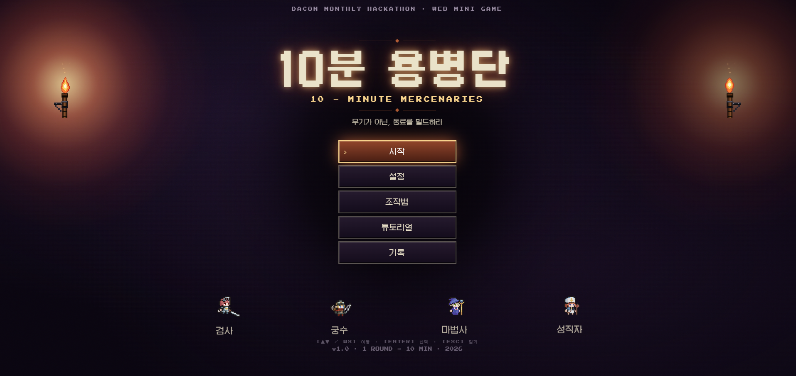
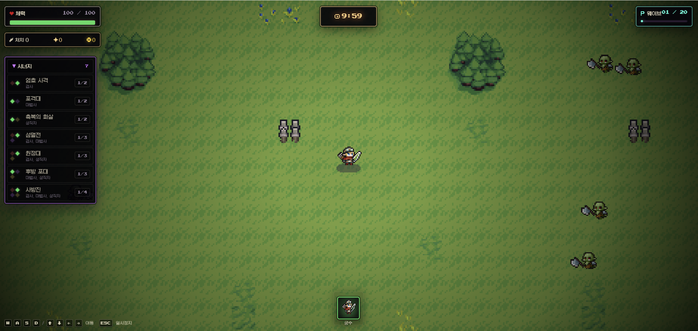

# 10분 용병단 (10-Minute Mercenaries)

무기가 아닌 동료를 빌드하는 웹 기반 자동전투 생존 미니게임입니다.
직접 공격하지 않고, 자동으로 싸우는 용병들을 고용·강화하며 20웨이브 동안 살아남으세요.

## 시연 영상

[](https://youtu.be/Fnkhc139HL4)

## 스크린샷

| 시작 화면 | 전투 화면 |
|---|---|
|  |  |

## 실행 방법

```bash
npm install
npm run dev
```

## 기술 스택

React · TypeScript · Vite · Phaser
